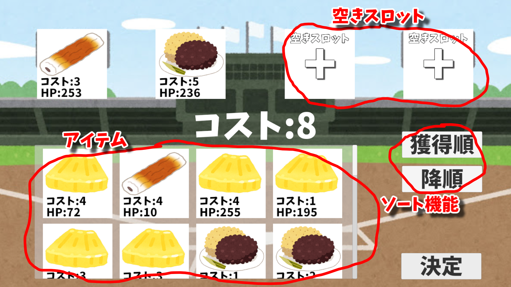

## 使用素材

・[いらすとや](https://www.irasutoya.com)

・[けいふぉんと](https://font.sumomo.ne.jp/font_1.html)

・[UniTask](https://github.com/Cysharp/UniTask/releases)

## 操作方法

・アイテムの上でマウスの右クリックを長押しすると、アイテムを掴んでドラッグ出来ます

・アイテムは空きスロットに入れる事が出来ます(4個まで)

・入れたアイテムの総コストが10未満の場合,「決定」をクリックするとコンソールに「Success」と表示されます(10以上の場合は「コストが上限値を越えています」と表示されます)

・現在のコストは真ん中のテキストで確認できます

・ソートは「獲得順」「コスト順」「HP順」「名前順」の中からソート出来ます(降順・昇順あり)

